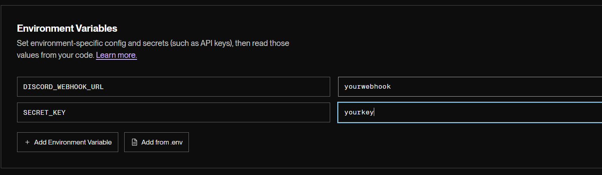

<a id="readme-top"></a>


<br />
<div align="center">
  <h1 align="center">🔐 {Webhook Protector} 🔐</h3>

  <p align="center">
    A simple way to avoid hard-coding your webhooks or risking a deletion.
    <br />
    <a href="https://github.com/yTax/webhook-protector/issues/new">Request Feature or report a bug</a>
  </p>
</div>
<div align="center">
    <a href="https://github.com/yTax/webhook-protector/graphs/contributors">
        
    </a>
    <a href="https://github.com/yTax/webhook-protector/network/members">
        
    </a>
    <a href="https://github.com/yTax/webhook-protector/stargazers">
        
    </a>
    <a href="https://github.com/yTax/webhook-protector/issues">
        
    </a>
</div>

    
    


# ⭐ 〢 Usage

This is a very simple script written in python that you can host anywhere, it has a very simple purpose which is ratelimitting and protecting your discord webhook from being deleted, this script will also be compatible with any other webhook integration if you make some small tweaks to it.
It is implemented in a very basic way using Flask.  

To understand how to use this read [Getting Started](#-〢-getting-started)


# 🚀 〢 Getting Started

The easiest way to install this for free is on [Render](#-〢-installation-on-render) (Lifetime free hosting).

If you want to install it [on your own server](#Installation-Local) you can simply download the files. Dont forget to edit main.py to setup your webhook and key or to hook it up to a .env file!


# 💻 〢 Installation on Render

1. Setup a [Render](https://dashboard.render.com/register) account.
2. [Fork](https://github.com/yTax/webhook-protector/fork) this repository.
3. Go to the [Dashboard](https://dashboard.render.com/select-repo?type=web) and click connect github.

4. Write `python main.py` as your start up command. Select Free as the instance type.

5. Click Enviroment and setup the environment variables like this:

```
DISCORD_WEBHOOK_URL : Write your webhook here.
SECRET_KEY : Write your key here, this is the key you will use to send requests to your render API. It can be whatever you want.
```
6. Press "Deploy Web Service"
7. After your service is deployed grab it's URL on the dashboard, it should look something like: `https://webhook-protectorbzx4y.onrender.com`

8. Now we need to keep our Render server alive 24/7, to do this make an account on [CronJob](https://console.cron-job.org/signup)
9. After creating your account, go to the [Dashboard](https://console.cron-job.org/dashboard) and click Create CronJob.

10. Type whatever you want for the title and set your Render URL as the CrobJob URL.
11. Set the execution schedule to every 5 minutes.
12. Go into the Advanced tab and set a header with the key `Authorization` and value `KeepAlive`, finally change your request method to `POST`.

13. Done! Your webhook is now protected. The cronjob will keep the render server alive 24/7.


# 📄 〢 Documentation
There are 2 example scripts on this repository that show you how to POST to your API and the `main.py` code is very well commented.
If you have any questions feel free to open an issue or contact me!

### Example on how to send a message containing files: 
`This script is inside SendJsonAndFiles.py`

```py
import requests

url = "render URL" # URL TO YOUR RENDER


payload = {
    "payload_json": '{"username": "test", "content": "hello"}' # your JSON payload, like an embed or a message, this is obviously optional if u just want to send a file
}

# Files to send
with open(r"PATH TO FILE ") as file: # here we use r"" to prevent python from fucking up the string
    files = {"file1": file} 

    # header with ur key
    headers = {"Authorization": "yourkey",}
    response = requests.post(url, data=payload, files=files, headers=headers)

    print(response.text)
```

### Example on how to send a message: 
`This script is inside SendJson.py`

```py
import requests

url = "your URL" # URL TO YOUR RENDER


payload = {"username": "test", "content": "hello"} # your JSON payload


# header with ur key
headers = {"Authorization": "yourkey",}
response = requests.post(url, json=payload, headers=headers)

print(response.text)
```

# 📋 〢 To-do List

- [ ] Possibly make a web-ui for this and an account system.
- [ ] Feel free to give any suggestions! 
